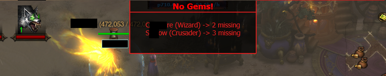

# Arkahr
Turbo.Plugins.Arkahr
```diff
+ LEFT click to download zip-> unzip -> Save As -> plugins/Arkahr/
```

<hr>

#### [TownPoIPlugin.cs](https://minhaskamal.github.io/DownGit/#/home?url=https://github.com/Arkahr/Arkahr/blob/master/TownPoIPlugin.cs)
Adds minimap texts and labels for NPCs in town to find them easier.

- Enchanting cauldron directions label.
- Followers minimap text.
- Uber Bosses minimap text.

- ~~Kadala Label with bood shard counter~~ [Improved version](https://www.ownedcore.com/forums/diablo-3/turbohud/turbohud-plugin-review-zone/677711-v7-6-international-one-shardsonkadala.html) by Mr. One ( [Code](https://pastebin.com/qvbpXQif) )

<hr>

#### [NoGemsPlugin.cs]()
Adds Popup when someone in your group does not have legendary gem in jewelery socket.

- Popup will not show if: someone is lower than 70lvl, you are not in town, there are no players missing gems (obviously)

#### [ConventionOfElementsBarPlugin.cs](https://minhaskamal.github.io/DownGit/#/home?url=https://github.com/Arkahr/Arkahr/blob/master/ConventionOfElementsBarPlugin.cs)
Shows time to your greates elemental bonus when wearing Convention of Elements ring in form of shrinkig bar.

- Configurable to place it somewhere else, change size, color of elements, opacity, switch off text numbers.

#### Cooldown Bars for rift pylons
Cooldown for rift pylons in form of shrinking bars.
#### Cooldown Bars for player skills
Cooldowns for class skills that you would to track in form of shrinking bars.
